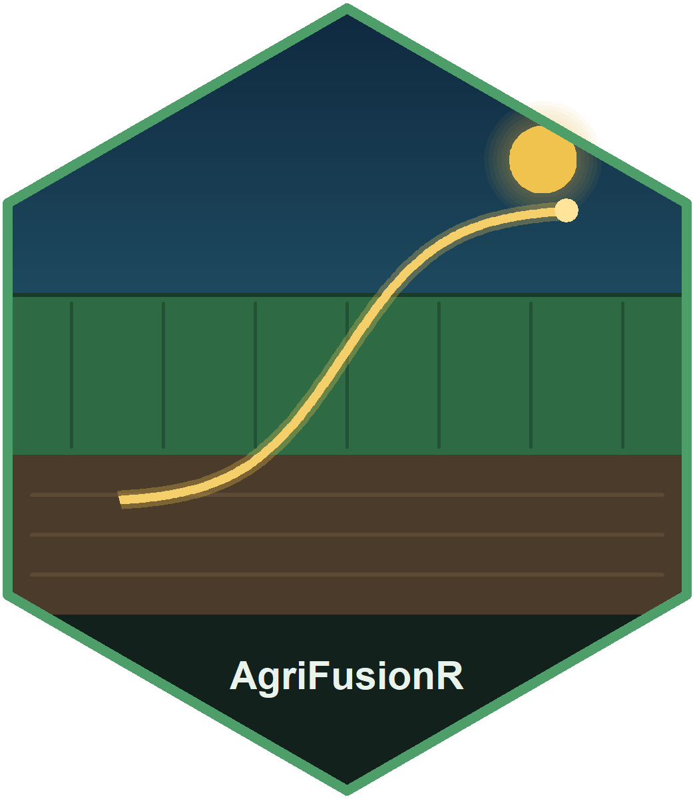

# AgriFusionR <a href="https://mqfarooqi1.github.io/AgriFusionR/"></a>

<!-- badges: start -->
[](https://lifecycle.r-lib.org/articles/stages.html#experimental)
[](https://github.com/mqfarooqi1/AgriFusionR/actions/workflows/R-CMD-check.yaml)
[](https://mqfarooqi1.r-universe.dev/AgriFusionR)
[](https://mqfarooqi1.github.io/AgriFusionR/)
[](https://opensource.org/licenses/MIT)
<!-- badges: end -->

<!--
CRAN badges: uncomment both once the package is accepted. Until then the
version badge renders blank and the download badge renders "downloads null",
because neither service has anything to report yet. They belong at the top of
the block, matching orbis, sddr and dataProfilerR.

[](https://CRAN.R-project.org/package=AgriFusionR)
[](https://CRAN.R-project.org/package=AgriFusionR)
-->

**An integration framework for agricultural analytics.**

> **Version 0.1.0 — prepared for CRAN.** Spine, live ingestion, ten learners,
> five explanation methods and plotting. The API may still change. See
> [ARCHITECTURE.md](ARCHITECTURE.md) for the design rationale and roadmap.

## Why this exists

R is already well supplied for agricultural machine learning. A survey of CRAN
(24,462 packages, August 2026) found mature packages for every individual
capability: five for spatial cross-validation alone (`blockCV`, `CAST`,
`sperrorest`, `spatialsample`, `mlr3spatiotempcv`), seven for climate
ingestion, three for Earth observation, and every learner worth having.

**What is missing is the layer that joins them.** Assembling a design matrix
keyed by management unit and season, from sources on different grids,
calendars and projections; aligning covariates to the crop's phenology rather
than the calendar; validating in a way that survives spatial autocorrelation;
and recording enough provenance to rebuild the analysis later. That glue is
hand-rolled on every project and shared on almost none.

So this package **delegates rather than reimplements**. It does not write
learners, cross-validation algorithms, raster IO or satellite access. It
provides the agronomic front end and hands off.

## The two defaults that are the point

1. **Covariates are aggregated over phenological windows**, derived from
   accumulated growing degree days. "Rainfall in September" means different
   things to two crops sown six weeks apart; "rainfall during grain fill"
   means the same thing to both.
2. **Models are validated with spatial resampling.** Random k-fold
   cross-validation under spatial autocorrelation flatters a model, because
   nearly every test point has a near-duplicate in training.
   `train_model()` reports both, so the optimism is a number rather than an
   argument.

## Use

```r
library(AgriFusionR)

p <- agri_project(demo_agri_data(n_units = 40, n_seasons = 4))
p <- add_climate(p, source = "demo")
p <- add_soil(p, source = "demo_soil")
p <- phenology_windows(p)
p <- build_features(p)

check_project(p)                       # leakage, missingness, outliers

m <- train_model(p, target = "yield")  # spatial folds by default
m
#> <agri_model>
#>   target     : yield
#>   learner    : ranger
#>   features   : 41
#>   resampling : spatial_block (5 folds)
#>   spatial CV : RMSE 0.557  MAE 0.472  R2 0.333  (n=160)
#>   random CV  : RMSE 0.234  MAE 0.191  R2 0.882
#>   optimism   : random CV overstates R2 by 0.549

predict(m, interval = TRUE)            # conformal intervals
explain(m)                             # out-of-fold permutation importance
uncertainty(m)                         # coverage
cat(report(m), sep = "\n")             # model card
```

That output is a real run, not an illustration, and it is the argument for the
package in one screen: the same model and the same data score **R² 0.88 under
random folds and 0.33 under spatial folds**. Reported the usual way, this model
looks strong. Reported honestly, it is mediocre. The gap is not an artefact of
the demonstration — it is what spatial autocorrelation does to a random split.

Interval calibration on the same run: nominal 90%, estimated coverage 0.906.

## Does it actually work?

The demonstration data are generated from a process that is known exactly, so
the pipeline can be checked against the truth rather than against a previous
run. It reproduces the generator's own quantities bit for bit — the feature
`prcp_sum_grain_fill` matches the rainfall the generator accumulated during
grain fill at correlation 1.000, and `heat_day_sum_silking` matches its
silking heat-day count with zero difference. That is the phenological staging
and the aggregation both being exactly right, and it is asserted in the tests.

## Does it hold on data we did not generate?

A claim demonstrated only on your own simulation is not worth much. So the same
pipeline was run on `agridat::lasrosas.corn` — 3,443 yield-monitor observations
from an Argentine maize field over two seasons, published by someone else, and
the setting where spatial autocorrelation bites hardest.

| Resampling | RMSE | R² |
|---|---|---|
| Spatial blocks | 14.226 | **0.485** |
| Random folds | 12.163 | **0.624** |
| | | **overstated by 0.138** |

Conformal coverage on the same run: **0.901 against a nominal 0.90**, on an
error distribution nothing like the simulated one. Permutation importance ranks
hilltop topography first, then brightness value, then applied nitrogen — which
is what an agronomist would expect for that field.

This is asserted in the test suite, so it is a regression test rather than a
one-off claim.

Live ingestion is also real: `add_climate(source = "power")` pulls daily
weather from NASA POWER through **nasapower**, and is verified to return the
requested window exactly.

219 tests; `R CMD check` clean, vignette included.

## What is wired up

**Data sources** (`list_sources()`) — NASA POWER, CHIRPS, Daymet, WorldClim,
SoilGrids, SRTM elevation with slope and aspect, plus two offline demo sources.
The first three and elevation are verified against the live services; WorldClim
and SoilGrids share the same extraction path but have not been run end to end.

**Learners** (`list_learners()`) — `lm`, `glm`, `knn`, `ranger`, `xgboost`,
`cubist`, `enet` (elastic net), `svm`, `gam`, and `stack`, a stacked ensemble
whose base learners are weighted by non-negative least squares. Every one is
checked against a signal it should recover, and for row alignment, so an
adapter that runs but predicts nonsense fails the suite.

**Visualisation** — base graphics throughout, so plotting needs no extra
package. `plot()` methods for projects, resampling schemes and models;
`plot_map()` for predicted, residual and error surfaces; `plot_effect()` for
ALE, PDP and ICE curves; `plot_uncertainty()` for interval coverage. Plotting
the resampling scheme is the useful one — you can see whether the blocking
actually blocked anything, rather than assuming it did.

**Explanations** (`explain()`) — out-of-fold permutation importance, partial
dependence, **accumulated local effects**, **ICE** curves, and exact **tree
SHAP** via `treeshap`. ALE is preferred to partial dependence when predictors
are correlated, which for weather features they always are.

## Installing

No heavy dependencies. `Imports` is `graphics`, `grDevices`, `stats` and
`utils` — all base packages. `sf`, `terra`, `ranger`, `xgboost` and the rest
are `Suggests` behind capability detection, so the package installs anywhere
and the core works on a spreadsheet of trial plots.

```r
install.packages("AgriFusionR", repos = "https://mqfarooqi1.r-universe.dev")
```

Or the development version from GitHub:

```r
# install.packages("remotes")
remotes::install_github("mqfarooqi1/AgriFusionR")
```

## Extending it

A new data provider or algorithm is a function plus one registration call:

```r
register_source("my_provider",
                fetch = function(units, seasons, ...) { ... },
                provides = c("tmin", "tmax"), kind = "series")

register_learner("my_model",
                 fit = function(x, y, ...) { ... },
                 predict = function(object, newx, ...) { ... })
```

## Honest limitations

- **Early stage.** Only the offline demo sources and a NASA POWER adapter are
  written. Soil, satellite and raster paths are designed, not built.
- **The shipped crop thermal parameters are indicative defaults**, not
  calibrated constants. Calibrate them locally before publishing anything.
- **Tabular only so far.** Raster and Earth-observation ingestion is Phase 2.
- **Imputation is fold-wise median substitution**, adequate for light
  missingness and nothing more.
- **The demo data are simulated**, with a known data-generating process, so the
  tests can check that the pipeline recovers the truth rather than a previous
  run.

## References

- Roberts, D. R. et al. (2017) *Ecography* **40**, 913–929. [doi:10.1111/ecog.02881](https://doi.org/10.1111/ecog.02881)
- Meyer, H. & Pebesma, E. (2021) *Methods Ecol. Evol.* **12**, 1620–1633. [doi:10.1111/2041-210X.13650](https://doi.org/10.1111/2041-210X.13650)
- McMaster, G. S. & Wilhelm, W. W. (1997) *Agric. For. Meteorol.* **87**, 291–300. [doi:10.1016/S0168-1923(97)00027-0](https://doi.org/10.1016/S0168-1923(97)00027-0)
- Lei, J. et al. (2018) *J. Am. Stat. Assoc.* **113**, 1094–1111. [doi:10.1080/01621459.2017.1307116](https://doi.org/10.1080/01621459.2017.1307116)
